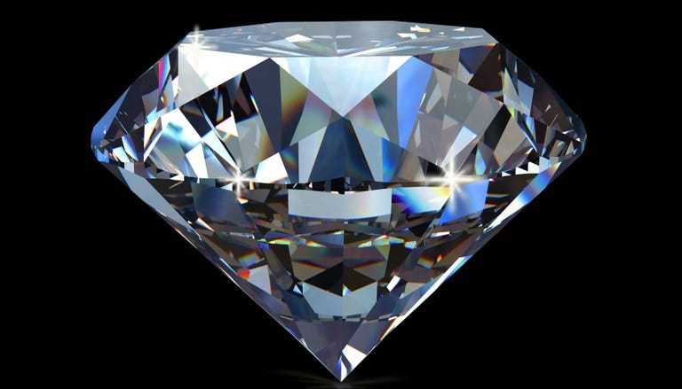

## Diamond Price Prediction Using Machine Learning

## Deployment URl:
```bash
https://diamond-prices-prediction-1.onrender.com
```

### Overview
This project aims to predict diamond prices using machine learning techniques. The dataset used for this project contains various attributes of diamonds such as carat weight, cut, color, clarity, etc., along with their corresponding prices. By training a machine learning model on this dataset, we can predict the price of a diamond given its characteristics.

### Dataset
**The dataset** The goal is to predict `price` of given diamond (Regression Analysis).

##### There are 10 independent variables (including `id`):

* `id` : unique identifier of each diamond
* `carat` : Carat (ct.) refers to the unique unit of weight measurement used exclusively to weigh gemstones and diamonds.
* `cut` : Quality of Diamond Cut
* `color` : Color of Diamond
* `clarity` : Diamond clarity is a measure of the purity and rarity of the stone, graded by the visibility of these characteristics under 10-power magnification.
* `depth` : The depth of diamond is its height (in millimeters) measured from the culet (bottom tip) to the table (flat, top surface)
* `table` : A diamond's table is the facet which can be seen when the stone is viewed face up.
* `x` : Diamond X dimension
* `y` : Diamond Y dimension
* `x` : Diamond Z dimension

### Target variable:
* `price`: Price of the given Diamond.

## Dataset Source Link :
[https://www.kaggle.com/competitions/playground-series-s3e8/data?select=train.csv](https://www.kaggle.com/competitions/playground-series-s3e8/data?select=train.csv)


## Dependencies
To run this project, the following dependencies are required:

##### Python 3.09
##### NumPy
##### Pandas
##### Scikit-learn
##### Flask


## Run the prediction script:
#### Copy code
python application.py
#### Input the characteristics of the diamond when prompted, such as carat weight, cut, color, clarity, depth, and table.
#### The predicted price of the diamond will be displayed.


## Future Improvements
Experiment with different machine learning algorithms to improve prediction accuracy.
Perform feature engineering to extract more relevant information from the dataset.
Collect additional data to further train and validate the model.

## Contributors
➡️ABHISHEK UPADHYAY
➡️Email id: abhishekupadhyay9336@gmail.com
